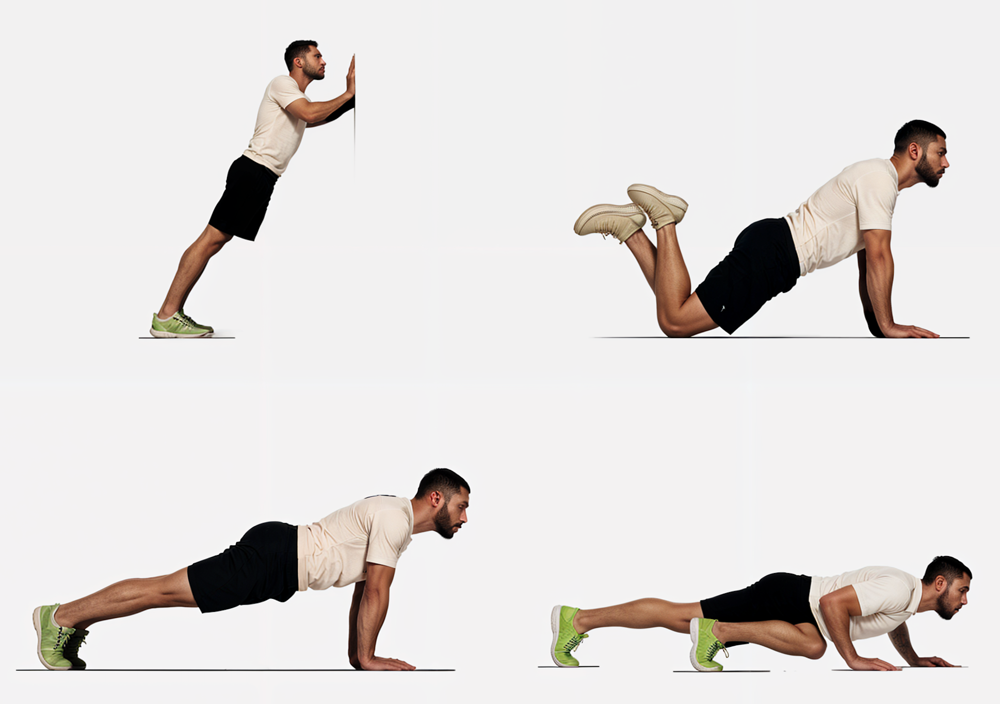
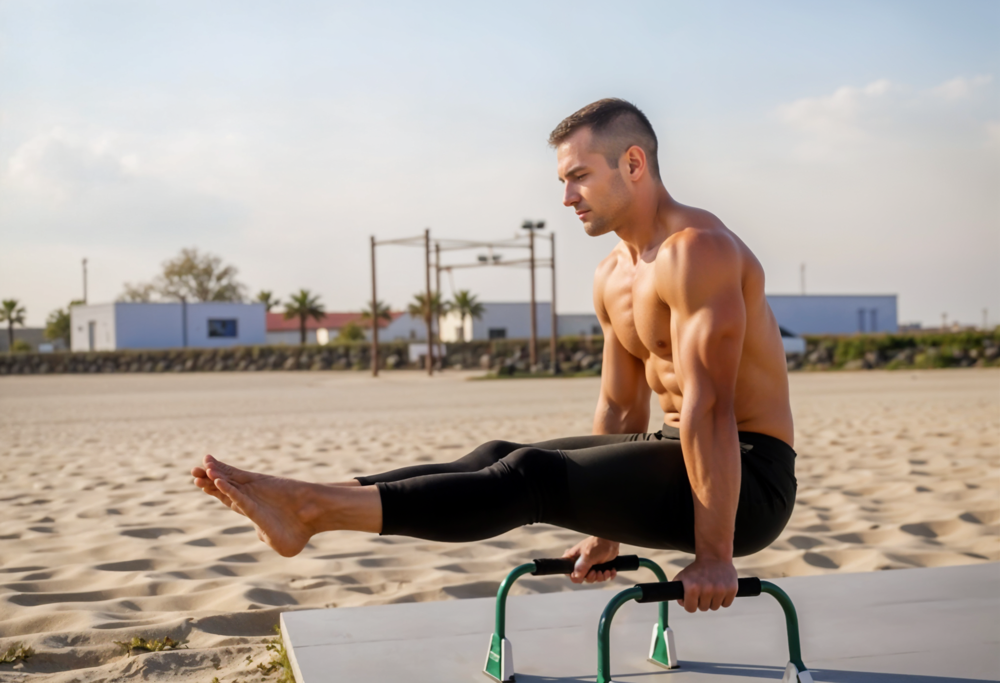

Have you ever felt insecure about your physical capability and appearance? **I have**. A few years ago, I went through a difficult personal time. I realized that after the birth of my second child, I had greatly neglected my physical condition. Between work, raising two children, and let's be honest, **laziness**, I had practically abandoned physical exercise completely. Add to that dangerous cocktail having a sedentary job as a programmer.

I must admit that my catalyst for seeking change began for the wrong reasons: I looked terrible in the mirror and in photos. And I didn't like that at all. If you add a divorce to that mix, I can say it was probably the lowest point of self-esteem in my life. I've never had weight problems, and fortunately, no health issues either. But by current standards, you could say I was out of shape. So I decided to find a solution.

My first idea was to get back into running. I had been quite a runner in the past and thought that might help me. But after researching a bit more, I realized that wouldn't give me what I was looking for, just as it hadn't in the past. Running is a fantastic exercise, but **it doesn't build muscle**, and as I began to learn back then, if you want to shape your body and also lose weight, **you need to train for strength**. So I continued researching what that meant, as it was quite unfamiliar to me.

When you're looking to train for strength, the first thing people recommend is joining a gym.

## Why the Gym Didn't Work for Me

Going to the gym is an excellent idea, but with caveats. First, "going to the gym" **creates friction**, and that's always a problem when you're trying to build a new habit. Once you've signed up, you have to overcome the mental barrier of getting dressed for exercise, traveling to the gym (which might not be close to your home), and then working out.

If you manage to overcome that barrier, you'll encounter another problem. You can train for strength in many ways, and that can sometimes be a bit intimidating. You can lift weights, whether with barbells, dumbbells, or kettlebells, or you can use the machines at the gym. If you're new to this, you'll most likely need help. There are millions of exercises you can do, millions of different ways to organize your training, and everyone seems to have contradictory advice. So what's best?

I would initially avoid gym machines. Most of them are designed to isolate a single muscle group and work it directly. That's fine if you're someone trying to define a specific muscle, but trust me, when you're new (and even not so new), you're far from that stage. **Training several muscle groups at once will be much more useful for you**, and that's what you do with more classic weightlifting exercises.

I would recommend that you **simplify**. Especially if you're just starting to train for strength, complicating things will only make it harder. If you decide to lift weights, you can start with the basic exercises that will give you what you're looking for: barbell squats, bench press, and deadlifts. Those three exercises will keep you busy for a long time and allow you to make tremendous progress. Learning proper technique takes time, and it's very important to perform exercises correctly to avoid injuries. Since you can adjust the weight to your level, you can progressively increase the difficulty and focus on doing the exercises properly. Later, you can incorporate other exercises.

But what if you don't have time to go to the gym? What if you can't afford it? What if you don't like the gym? These are some of the reasons why I knew the gym wasn't going to work in my case.

## Calisthenics

Just like strength exercises based on weightlifting, calisthenics follows the same principle. When lifting weights, you're making your muscles work and stressing them, and by progressively increasing the weight, they grow from stimulation (also helping you lose weight). The difference is that **instead of using external weight, you use your own body weight**.

The exercises you can do with your body are endless. And there are options for **all levels**. To start practicing, you hardly need any equipment. Comfortable clothes and perhaps a pull-up bar (I have one that cost me €20) if you want to explore more exercises. You don't need much space either, and you can practice anywhere, whether at home or on vacation. If you like training outdoors, calisthenics parks are becoming increasingly common (at least in Spain), as they're inexpensive and very beneficial for local residents' health. But you can also use children's playgrounds, as long as they give you some space. Even tree branches can serve the purpose.

Like weightlifting, **the difficulty is progressive**. With weightlifting, it's a matter of adding more plates to the bar, but in calisthenics, progressions are a bit more imaginative. Generally, they're all based on inclination. Let's take the example of push-ups:

1. If you can't do any, you can start by doing them against the wall instead of on the floor
2. Then you can lower yourself more and do them supporting your knees
3. Then you can do just the negative part of the push-up, that is, lowering yourself as slowly as possible while maintaining good form
4. Then you'll be able to do a normal push-up on the floor
5. And then you can progressively increase the difficulty by raising your legs, eventually reaching handstand push-ups (this is already a high level)

You can find similar progressions for all exercises, whether squats, pull-ups, dips, etc.

And if you want to start right away, you just need to focus on **three basic exercises: pull-ups, push-ups, and squats**. Depending on your physical condition, you might not be able to do even a single strict repetition of any of them, but don't despair because you can start at the most basic level until you achieve it.

## A Functional Body

Earlier, I mentioned that I started the change for the wrong reasons. I approached it from an aesthetic point of view, but over the years, I've realized that it's **much more important to have a functional body**. I'm watching close family members age, and I see how their bodies are becoming increasingly clumsy, even for everyday simple actions. Aging can't be avoided, but you can age better. Scientific studies show that we lose muscle mass as we age.

If you're not careful, you can enter a **dangerous spiral**. First, you lose some muscle strength, which makes certain activities more difficult for you. Since they're more difficult, you avoid them. By avoiding them, your muscles weaken even more, making even simpler tasks now a challenge. And by the time you realize it, it's very difficult to turn back.

If you have a strong, functional body at 40 and you keep training it, when you're 50, you'll have a much better quality of life than if you hadn't exercised at all. Even as your body ages. And the same applies when you're 60 or 70. **The goal should be to age better**.

And that's one of the things I like most about calisthenics. If you choose the exercises well, you'll be working your entire body. As you progress with a specific exercise to increase its difficulty, you see that you need to engage new muscles, and that you even lack flexibility and mobility in some of them.

For example, I'm practicing the L-sit, which is a relatively simple calisthenics exercise. Well, I've realized that my core is too weak, and because my work is very sedentary, I have very little mobility in my hips, making it very difficult for me to raise my legs to hold them. This forces you to add new exercises to improve your mobility and strength, which is very beneficial and even helps with back pain.

But this is just one example. There are many more. As humans, we should be capable of performing many more efforts than we do in our daily lives. If you have to carry grocery bags and need to stop frequently, something is wrong. If you can't even run down the block because you're late, something is wrong. If you wake up and a lot of muscles in your body hurt, something is wrong. If you can't play a quick game of soccer or basketball with your children, or play tag, something is wrong. **And that's what we must avoid**.

For me, calisthenics is a way to **understand my body**, stay in shape, and remain in good condition as I get older. I also like the challenges it presents and its progressive approach because when you reach the next level, you feel very proud. I still remember the day I was able to do my first push-up on the floor. I couldn't even do one, and in a few weeks, I was able to achieve it.

Also, it's **easy to start, and very inexpensive**. So if you're looking to break away from your sedentary lifestyle, don't hesitate any longer and give calisthenics a chance. I've gone from not being able to do a single pull-up or push-up to being able to do sets of several repetitions. And I'm training to achieve other more complex calisthenics tricks, like the front lever and the tuck planche, which are coming along well.

**Get motivated and break the spiral. The sooner you start, the better for your future.** If you need help, don't hesitate to ask. If there's interest, I'll share more information in the future, although nowadays it's very easy to find it.